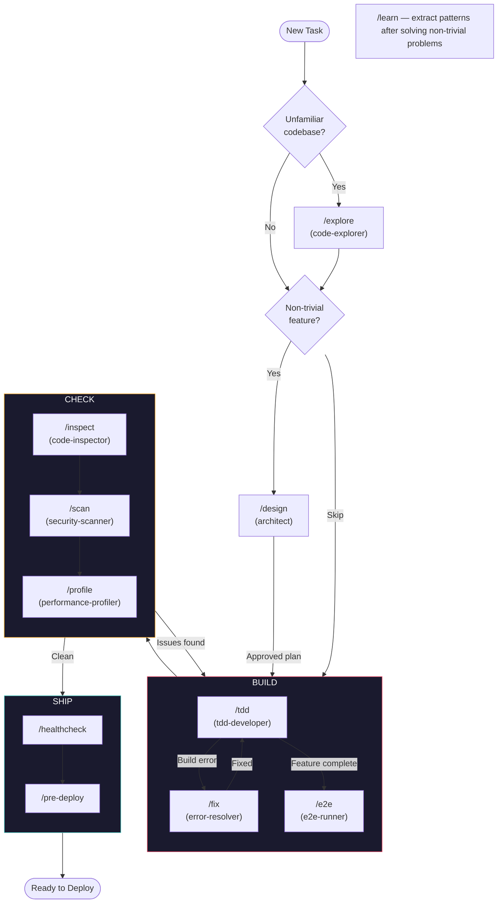

# Claude Forge — TypeScript Edition

The complete Claude Code development system for TypeScript, React, and Next.js projects.

8 agents, 13 commands, 10 hooks, 5 skills, 5 rules — wired together with handoffs. Built for: **TypeScript, React, Next.js (App Router), Prisma, Tailwind, Vitest/Jest, Playwright.**

## Agents

| Agent | Role | Model |
|-------|------|-------|
| **architect** | Research solutions, design systems, plan implementations, document decisions | opus |
| **tdd-developer** | Build test-first — Red/Green/Refactor with coverage targets | sonnet |
| **error-resolver** | Fix build/type/compile errors — one at a time, minimal diffs | sonnet |
| **code-inspector** | Review for correctness, quality, React/Next.js patterns, PRs | sonnet |
| **security-scanner** | Scan for vulnerabilities — OWASP Top 10, secrets, injection | sonnet |
| **e2e-runner** | Create, run, and maintain Playwright E2E tests for critical flows | sonnet |
| **performance-profiler** | Profile bottlenecks — algorithms, bundle, queries, rendering | sonnet |
| **code-explorer** | Map unfamiliar codebases, generate onboarding guides + CLAUDE.md | sonnet |

## Commands

| Command | Action | Agent |
|---------|--------|-------|
| `/design` | Research + design + implementation plan | architect |
| `/tdd` | Test-driven development | tdd-developer |
| `/fix` | Fix build errors incrementally | error-resolver |
| `/inspect` | Review code (local or PR) | code-inspector |
| `/scan` | Security vulnerability audit | security-scanner |
| `/e2e` | E2E tests with Playwright | e2e-runner |
| `/profile` | Performance profiling and optimization | performance-profiler |
| `/explore` | Map and understand a codebase | code-explorer |
| `/refactor` | Restructure code safely (tests must exist first) | *(direct)* |
| `/add-tests` | Retroactively add missing test coverage | *(direct)* |
| `/learn` | Extract reusable patterns from current session | *(direct)* |
| `/healthcheck` | Build + types + lint + format + tests + secrets scan | *(direct)* |
| `/pre-deploy` | Deployment readiness checklist | *(direct)* |

## How It Flows



Not every task needs all phases. A bug fix skips THINK. A library evaluation skips BUILD. **You decide which tools to reach for.**

## Hooks (Automated Safety)

| Hook | Phase | What |
|------|-------|------|
| block-hook-bypass | Pre | Blocks `--no-verify` in git commands |
| pre-commit-scan | Pre | Blocks commits with secrets, console.log, debugger |
| block-force-push | Pre | Blocks `--force` push |
| config-guard | Pre | Warns on linter/formatter/CI config changes |
| next-public-secret-guard | Pre | Blocks `NEXT_PUBLIC_` prefix on server secrets |
| console-log-warn | Post | Warns on console.log in edits (skips test files) |
| build-fail-hint | Post | Suggests `/fix` on build failure |
| large-file-warn | Post | Warns when file exceeds 800 lines |
| env-gitignore-guard | Post | Warns if .env file created without .gitignore entry |
| test-reminder | Stop | Reminds to add tests if only source files changed |

## Skills (Deep Reference)

| Skill | Used By |
|-------|---------|
| `nextjs-app-router` | code-inspector, performance-profiler — Server/Client components, Server Actions, caching |
| `prisma-patterns` | architect, tdd-developer — schema, migrations, serverless pooling |
| `tdd-patterns` | tdd-developer, e2e-runner — test examples, mocking, factories, CI |
| `security-checklist` | security-scanner — 13 categories with verification commands |
| `coding-standards` | code-inspector — naming, immutability, async, React, API, smells |

## Rules (Always On)

| Rule | Enforces |
|------|----------|
| `code-quality` | Immutability, function/file size, naming, no console.log |
| `security` | Pre-commit checks, secret management, auto-escalation, emergency protocol |
| `testing` | Coverage targets (authoritative source), TDD workflow, logging standards |
| `git` | Conventional commits, branch hygiene, PR standards |
| `model-strategy` | Model routing (Haiku/Sonnet/Opus), context window management |

## Sample Workflow

A real feature implementation from start to finish:

```
1. /explore          → Map the codebase (first time only)
2. /design           → Research options, design architecture, get plan approved
3. /tdd              → Build test-first (RED → GREEN → REFACTOR)
   └── /fix          → Fix any build errors along the way
4. /e2e              → Add E2E tests for critical user flows
5. /inspect          → Review for correctness, quality, patterns
6. /scan             → Security audit (auth, input, secrets)
7. /profile          → Profile performance if needed
8. /healthcheck      → Final verification (build + types + lint + tests)
9. /pre-deploy       → Deployment readiness checklist
```

Not every task needs all steps. A bug fix: `/tdd` → `/inspect` → `/healthcheck`. A config change: just edit and `/healthcheck`.

## Prerequisites

- **Claude Code** v1.0+
- **Node.js** 18+ (for hooks)
- **git** (for hooks that inspect staged changes)
- **jq** (for automatic hook installation — `brew install jq` on macOS)

## Quick Start

```bash
git clone https://github.com/codebysantosh-eng/claude-forge-typescript.git
cd claude-forge-typescript

# Install globally (available in all projects)
./install.sh

# Or install to a specific project
./install.sh --project /path/to/your-project

# Uninstall
./uninstall.sh              # global
./uninstall.sh --project /path/to/your-project
```

## Philosophy

1. **Agents have roles, not numbers** — Reach for the right tool, not the next step in a pipeline
2. **Commands match agents** — `/inspect` → code-inspector. `/scan` → security-scanner. No guessing.
3. **Skills are reference, not workflow** — Agents carry workflow; skills are lookup tables
4. **Rules are guardrails** — Always on, always enforced, never in the way
5. **Hooks are a safety net** — Catch mistakes before they become commits
6. **Single source of truth** — Coverage targets in `rules/testing.md`, patterns in skills, examples in agents
7. **TypeScript/React first** — Optimized for the TS/React/Next.js ecosystem

## Troubleshooting

| Problem | Cause | Fix |
|---------|-------|-----|
| Hook blocked my commit | `pre-commit-scan` found secrets, `console.log`, or `debugger` | Remove the flagged code, then commit again |
| "NEXT_PUBLIC_ prefix exposes secrets" | `next-public-secret-guard` caught a server secret with `NEXT_PUBLIC_` prefix | Remove the prefix — server secrets must not be exposed to the browser |
| "Force push blocked" | `block-force-push` prevents `--force` | Use `--force-with-lease` instead |
| "Config guard" warning | You're editing a shared config file | Intentional? Proceed. Accidental? Revert. |
| Hook not running | Hooks not merged into `settings.json` | Re-run `./install.sh` (requires `jq`) or manually merge `hooks/hooks.json` |
| Agent picks wrong model | Model is set in agent frontmatter | Edit the `model:` field in the agent's `.md` file |
| `/fix` can't resolve error | Error requires architectural changes | Use `/design` to plan the restructure, then `/tdd` to implement |
| Build still failing after `/fix` | Circular dependency or config issue | Check `tsconfig.json` paths, clear `.next/` cache, restart dev server |

**Recovering from backups**: The install script creates timestamped backups at `~/.claude/.backup-YYYYMMDD-HHMMSS/`. To restore: `cp -r ~/.claude/.backup-<timestamp>/* ~/.claude/`

## License

MIT
